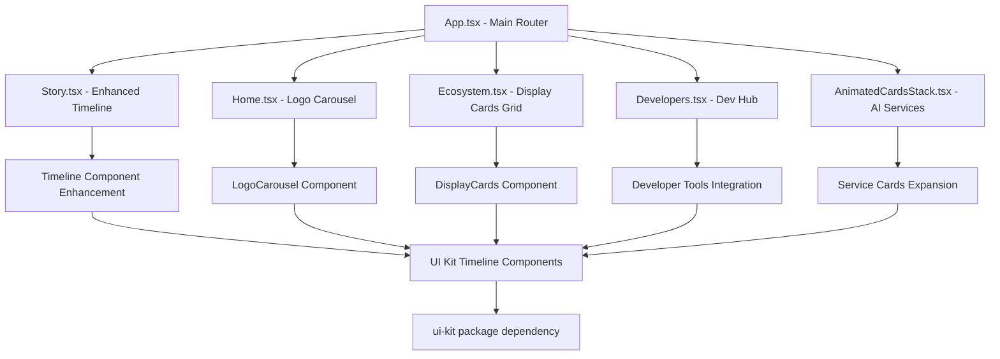

# Lan Onasis Landing Page Component Integration Map

## Current Components Analysis

### Existing Components in lanonasis-index
1. **Timeline.tsx** - Basic timeline component with 6 milestones
2. **AnimatedCardsStack.tsx** - Grid of 5 service cards with basic animations

### UI Kit Components Available
1. **VendorPartnershipSection** - For showcasing partners and vendors
2. **LogoCarousel** - Dynamic carousel for partner logos
3. **DisplayCards** - Enhanced card components for platform offerings
4. **AI Service Cards** - Specialized cards for AI service presentations

## Proposed Component Integration Plan

### Phase 1: Enhanced Timeline Integration
**Component**: "Built By Visionaries" timeline
**Location**: src/routes/Story.tsx
**Integration Points**:
- Replace existing Timeline component with enhanced version
- Add more sophisticated milestones with achievements
- Integrate with UI Kit Timeline components if available

### Phase 2: Animated Cards Stack Enhancement
**Component**: Animated Cards Stack for AI service offerings
**Location**: src/components/AnimatedCardsStack.tsx
**Integration Points**:
- Expand from 5 to 7+ service cards
- Add platform-specific icons from UI Kit
- Enhance animations with framer-motion

### Phase 3: Logo Carousel Integration
**Component**: Logo Carousel for partners and vendors
**Location**: New component in src/components/LogoCarousel.tsx
**Integration Points**:
- Add to homepage after hero section
- Use UI Kit LogoCarousel component
- Configure with partner logo data

### Phase 4: Display Cards Grid
**Component**: Display Cards grid for offerings across platforms
**Location**: New section in src/routes/Ecosystem.tsx or dedicated route
**Integration Points**:
- Create grid layout for 5 different platforms
- Use UI Kit DisplayCards components
- Add platform-specific content and features

### Phase 5: Vendor Partnership Section
**Component**: Vendor partnership section with custom UI
**Location**: New section in src/routes/Story.tsx or dedicated route
**Integration Points**:
- Add partnership value propositions
- Use UI Kit VendorPartnershipSection component
- Include call-to-action for vendor onboarding

### Phase 6: Developer Tools Integration
**Component**: Developer hub section
**Location**: New route at src/routes/Developers.tsx
**Integration Points**:
- Link to api.lanonasis.com for developer interface
- Showcase VS Code memory extension
- Include CLI/SDK documentation links
- Highlight MCP-enabled tooling

## Component Dependencies Mapping



## Route Structure Enhancement

### Current Routes
- Story.tsx (About/Story section)
- Vision.tsx
- Ecosystem.tsx
- Contact.tsx

### Proposed New Routes
- Developers.tsx (Developer hub with redirect to api.lanonasis.com)
- Partners.tsx (Vendor partnership section)
- Platforms.tsx (Platform-specific pages)

## Data Structure Requirements

### Timeline Milestones
```typescript
interface TimelineMilestone {
  year: string;
  title: string;
  description: string;
  icon: React.ElementType;
  color: string;
  achievement: string;
}
```

### Service Cards
```typescript
interface ServiceCard {
  name: string;
  icon: React.ElementType;
  hero: string;
  description: string;
  valueProps: string[];
  image: string;
  gradient: string;
}
```

### Platform Cards
```typescript
interface PlatformCard {
  platform: string;
  title: string;
  description: string;
  features: string[];
  link: string;
}
```

## Integration Strategy

1. **UI Kit Integration**:
   - Import components from @lan-onasis/ui-kit package
   - Ensure proper TypeScript typing
   - Maintain consistent design language

2. **API Redirect Setup**:
   - Add navigation link to api.lanonasis.com
   - Implement proper routing with React Router
   - Add SEO metadata for developer resources

3. **Cross-Platform Consistency**:
   - Shared authentication flow implementation
   - Consistent styling using Tailwind CSS
   - Responsive design for all components

4. **Performance Optimization**:
   - Lazy loading for enhanced components
   - Code splitting for route components
   - Image optimization for service cards
