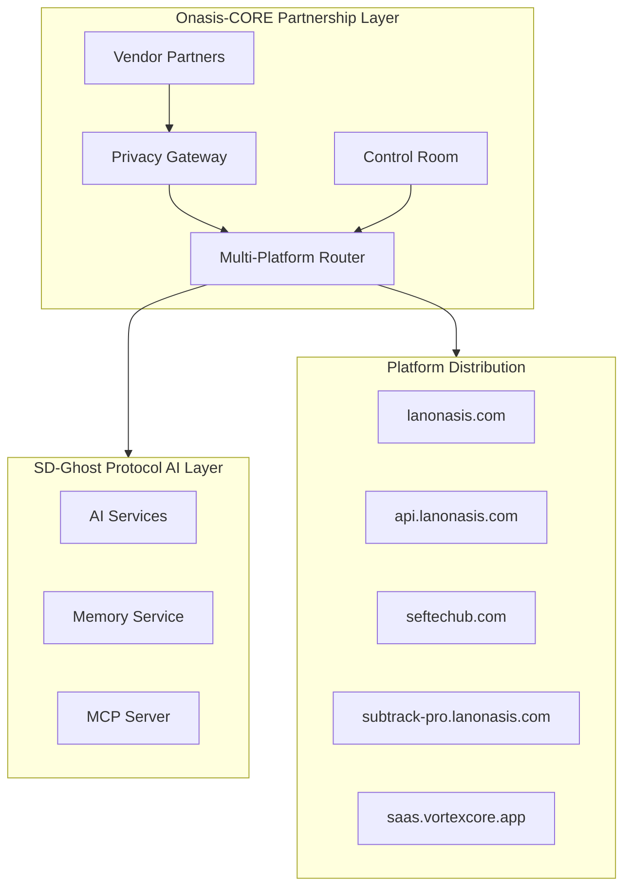
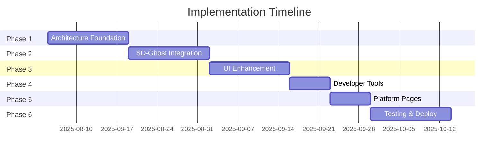

# Lan Onasis Landing Page Enhancement - Detailed Implementation Plan

**Date:** August 4, 2025  
**Version:** 1.0  
**Status:** Ready for Review

## Executive Summary

This implementation plan outlines the comprehensive strategy to enhance the Lan Onasis landing page ecosystem, integrating the UI toolkit components while adhering to the Onasis-CORE architecture separation principles. The plan addresses both the immediate UI enhancements and the broader platform integration goals.

## Architecture Overview



## Phase 1: Architecture Foundation Setup (Week 1-2)

### 1.1 Vendor Management Infrastructure
- **Location**: `packages/onasis-core/vendor-management/`
- **Components**:
  - Vendor registry database schema
  - API key generation and management
  - Partnership tier system (Basic, Pro, Enterprise)
  - Vendor onboarding workflow

### 1.2 Privacy Gateway Layer
- **Location**: `packages/onasis-core/privacy-gateway/`
- **Implementation**:
  ```typescript
  // Privacy Gateway Core
  interface PrivacyGateway {
    anonymizeRequest(vendor: VendorProfile, request: APIRequest): AnonymizedRequest;
    trackUsage(vendorId: string, service: string, tokens: number): void;
    validateAccess(vendorKey: string, requestedService: string): boolean;
  }
  ```
- **Features**:
  - Request/response anonymization
  - Token-based usage tracking
  - Service access control

### 1.3 Multi-Platform Router
- **Location**: `packages/onasis-core/platform-router/`
- **Routing Configuration**:
  ```yaml
  platforms:
    - domain: lanonasis.com
      services: [landing, auth, dashboard]
    - domain: api.lanonasis.com
      services: [api-gateway, developer-tools]
    - domain: seftechub.com
      services: [mcp-server, memory-service]
    - domain: subtrack-pro.lanonasis.com
      services: [subscription-management]
    - domain: saas.vortexcore.app
      services: [finance-platform]
  ```

### 1.4 Control Room Dashboard
- **Location**: `apps/control-room/`
- **UI Components**: Built By Visionaries Timeline for system health
- **Features**:
  - Real-time platform monitoring
  - Vendor activity tracking
  - Service health metrics
  - Billing dashboard

## Phase 2: SD-Ghost Protocol Integration (Week 3-4)

### 2.1 AI Service Layer Configuration
- **Location**: `packages/sd-ghost-protocol/`
- **Service Registry**:
  ```typescript
  const aiServices = {
    'text-generation': { model: 'gpt-4', provider: 'openai' },
    'image-generation': { model: 'dall-e-3', provider: 'openai' },
    'memory-search': { model: 'embedding-ada', provider: 'openai' },
    'code-assistance': { model: 'claude-3', provider: 'anthropic' }
  };
  ```

### 2.2 Request Routing System
- **Implementation Flow**:
  1. Vendor sends request to Onasis-CORE
  2. Privacy Gateway anonymizes request
  3. Router directs to SD-Ghost Protocol
  4. SD-Ghost processes with appropriate AI service
  5. Response flows back through Privacy Gateway

### 2.3 API Key Strategy
- **Dual Key System**:
  - Vendor Keys: For external partners (rate-limited, tracked)
  - Service Keys: For internal platform communication (unlimited)
- **Key Management UI**: Display Cards component for key visualization

### 2.4 Billing & Usage Tracking
- **Components**:
  - Token-based usage calculator
  - Tiered pricing model
  - Invoice generation system
  - Stripe integration for payments

## Phase 3: Landing Page UI Enhancement (Week 5-6)

### 3.1 Homepage Structure
```
├── Hero Section
│   ├── Animated headline with typing effect
│   ├── CTA buttons (Button component variants)
│   └── Background gradient animation
├── About/Story Section
│   └── Built By Visionaries Timeline (2020-2025)
├── Services Section
│   ├── Animated Cards Stack (AI services)
│   └── Display Cards Grid (5 platforms)
├── Partners Section
│   └── Logo Carousel (vendor partners)
├── Developer Hub
│   ├── MCP Tools showcase
│   ├── VS Code extension preview
│   └── CLI/SDK documentation
└── Footer
    ├── Platform links
    └── Legal/Privacy links
```

### 3.2 Component Integration Map

| Section | UI Component | Data Source | Animation |
|---------|-------------|-------------|-----------|
| Hero | Custom Hero | Static | Framer Motion fade-in |
| About | Built By Visionaries Timeline | Timeline data | Scroll-triggered |
| Services | Animated Cards Stack | Service registry | 3D transform on scroll |
| Partners | Logo Carousel | Vendor database | Auto-scroll |
| Platforms | Display Cards | Platform config | Hover effects |
| Team | Avatar components | Team data | Fade-in |

### 3.3 Responsive Design Strategy
- **Breakpoints**: 
  - Mobile: < 640px
  - Tablet: 640px - 1024px
  - Desktop: > 1024px
- **Component Adaptations**:
  - Timeline: Vertical on mobile, horizontal on desktop
  - Cards Stack: Single column on mobile, 3D stack on desktop
  - Logo Carousel: 2 logos on mobile, 5+ on desktop

## Phase 4: Developer Tools Integration (Week 7)

### 4.1 Developer Hub Architecture
- **Location**: `apps/lanonasis-index/src/pages/developers/`
- **Sections**:
  1. VS Code Memory Extension
     - Download links (.vsix files)
     - Installation guide
     - Feature showcase with Display Cards
  2. CLI/SDK Documentation
     - Quick start guide
     - API reference
     - Code examples
  3. MCP Tools Gallery
     - Available tools grid
     - Integration examples
     - Performance metrics

### 4.2 Interactive Components
```typescript
// Developer tools showcase
const DeveloperShowcase = () => {
  return (
    <div className="grid grid-cols-1 md:grid-cols-3 gap-6">
      <DisplayCard
        title="VS Code Extension"
        description="AI-powered memory for your IDE"
        icon={<CodeIcon />}
        action={{ label: "Download", href: "/downloads/memory.vsix" }}
      />
      <DisplayCard
        title="CLI Tools"
        description="Command-line interface for all services"
        icon={<TerminalIcon />}
        action={{ label: "Install", command: "npm install -g @lanonasis/cli" }}
      />
      <DisplayCard
        title="MCP Server"
        description="Model Context Protocol integration"
        icon={<ServerIcon />}
        action={{ label: "View Docs", href: "/docs/mcp" }}
      />
    </div>
  );
};
```

## Phase 5: Platform-Specific Pages (Week 8)

### 5.1 Platform Landing Pages
Each platform gets a dedicated landing section:

1. **lanonasis.com** (Main Portal)
   - Corporate overview
   - Platform selector
   - Partner showcase

2. **api.lanonasis.com** (Developer Gateway)
   - API documentation
   - SDK downloads
   - Interactive API explorer

3. **seftechub.com** (AI Tools Hub)
   - MCP server dashboard
   - Memory service interface
   - Tool marketplace

4. **subtrack-pro.lanonasis.com** (Subscription Platform)
   - Pricing tiers
   - Feature comparison
   - Customer portal

5. **saas.vortexcore.app** (Finance Platform)
   - Product features
   - Demo access
   - Enterprise solutions

### 5.2 Unified Navigation System
```typescript
const PlatformRouter = {
  routes: [
    { domain: 'lanonasis.com', component: MainLanding },
    { domain: 'api.lanonasis.com', component: DeveloperPortal },
    { domain: 'seftechub.com', component: AIToolsHub },
    { domain: 'subtrack-pro.lanonasis.com', component: SubscriptionManager },
    { domain: 'saas.vortexcore.app', component: FinancePlatform }
  ]
};
```

## Phase 6: Testing & Optimization (Week 9-10)

### 6.1 Testing Strategy
- **Unit Tests**: Component isolation testing
- **Integration Tests**: Cross-platform communication
- **Performance Tests**: Load time optimization
- **Accessibility Tests**: WCAG compliance

### 6.2 Performance Optimization
- **Code Splitting**: Dynamic imports for platform-specific code
- **Image Optimization**: WebP format, lazy loading
- **Animation Performance**: GPU acceleration, reduced motion support
- **Bundle Size**: Tree shaking, minification

### 6.3 Analytics Implementation
- **Tracking Points**:
  - Page views per platform
  - Vendor API usage
  - Service performance metrics
  - User journey mapping

## Implementation Timeline



## Success Metrics

1. **Technical Metrics**:
   - Page load time < 2s
   - Lighthouse score > 90
   - Zero critical accessibility issues
   - 99.9% uptime for all platforms

2. **Business Metrics**:
   - 50% increase in vendor partnerships
   - 30% improvement in developer adoption
   - 25% reduction in support tickets
   - 40% increase in API usage

## Risk Mitigation

| Risk | Impact | Mitigation Strategy |
|------|--------|-------------------|
| API Key Security | High | Implement rate limiting, key rotation |
| Performance Degradation | Medium | Progressive enhancement, CDN usage |
| Cross-Platform Sync | Medium | Event-driven architecture, webhooks |
| Vendor Data Privacy | High | Strict anonymization, audit logging |

## Next Steps

1. **Immediate Actions**:
   - Set up development environments for each phase
   - Create feature branches for parallel development
   - Initialize component library documentation

2. **Team Assignments**:
   - Frontend Team: UI component integration
   - Backend Team: Architecture foundation
   - DevOps Team: CI/CD pipeline setup
   - QA Team: Test plan development

3. **Communication Plan**:
   - Weekly progress reviews
   - Bi-weekly stakeholder updates
   - Daily standup for active phase teams

## Conclusion

This implementation plan provides a structured approach to enhancing the Lan Onasis landing page while building a robust, scalable architecture for the entire ecosystem. The phased approach ensures manageable milestones while maintaining flexibility for adjustments based on feedback and discoveries during implementation.