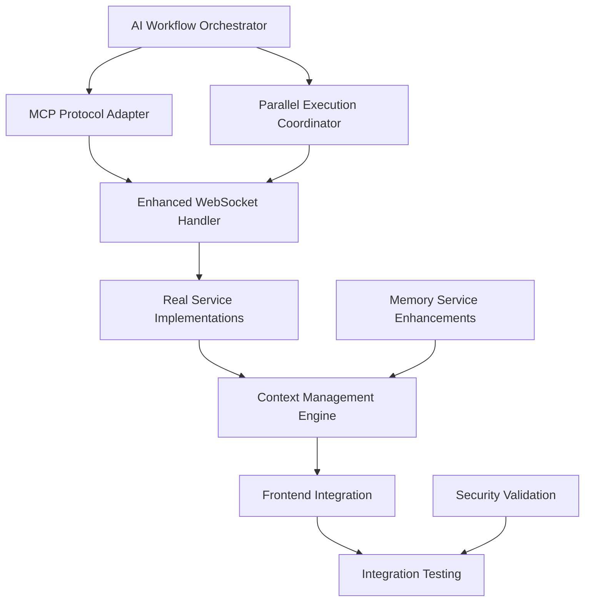

# 🚀 **Comprehensive MCP Integration Implementation Plan**

## **Executive Summary**
Based on the codebase review against [`ONASIS_CORE_MCP_INTEGRATION.md`](ONASIS_CORE_MCP_INTEGRATION.md), this plan addresses the critical 25% implementation gap to achieve full enterprise-grade MCP orchestration across the entire Lan Onasis monorepo.

---

## 📊 **Current State Assessment**

### **✅ Completed Components (75%)**
- WebSocket MCP Server infrastructure
- Enhanced API Gateway with privacy protection
- CLI integration with multi-mode connections
- Deployment infrastructure and containerization
- Basic tool implementations

### **❌ Critical Missing Components (25%)**
- AI Workflow Orchestrator (0% implemented)
- Parallel Execution Coordinator (0% implemented)
- MCP Protocol Adapter (25% implemented)
- Real service integrations (25% implemented)
- Cross-app orchestration (0% implemented)

---

## 🏗️ **Implementation Architecture**

```
┌─────────────────────────────────────────────────────────────────┐
│                    MONOREPO INTEGRATION MAP                     │
├─────────────────────────────────────────────────────────────────┤
│                                                                 │
│  📦 packages/onasis-core                                        │
│  ├── 🧠 AI Workflow Orchestrator (NEW)                        │
│  ├── ⚡ Parallel Execution Coordinator (NEW)                   │
│  ├── 🔄 Enhanced MCP Protocol Adapter (ENHANCE)               │
│  └── 🛡️ Privacy-Protected Service Registry (NEW)             │
│                                                                 │
│  🌐 apps/lanonasis-index                                       │
│  ├── 🔗 MCP Connection Dashboard (ENHANCE)                    │
│  ├── 📊 Orchestration Monitoring UI (NEW)                     │
│  └── 🎯 Workflow Template Gallery (NEW)                       │
│                                                                 │
│  🤖 apps/lanonasis-maas                                        │
│  ├── 🏢 Enterprise Workflow Builder (NEW)                     │
│  ├── 📈 Performance Analytics (NEW)                           │
│  └── 🔧 Service Integration Management (NEW)                   │
│                                                                 │
│  💾 services/memory-service                                    │
│  ├── 🔍 Enhanced Vector Search (ENHANCE)                      │
│  ├── 🧮 Context Management Engine (NEW)                       │
│  └── 📝 Workflow Memory Persistence (NEW)                     │
│                                                                 │
│  🎯 Integration Testing Suite (NEW)                            │
│  ├── 🧪 E2E Workflow Testing                                  │
│  ├── ⚖️ Load & Performance Testing                            │
│  └── 🔒 Security & Privacy Validation                         │
└─────────────────────────────────────────────────────────────────┘
```

---

## 📋 **Detailed Task Breakdown**

### **🎯 Phase 1: Core Orchestration Engine (Weeks 1-3)**

#### **Task 1.1: AI Workflow Orchestrator**
**Location**: `packages/onasis-core/orchestration/`
**Estimated Effort**: 15 days
**Priority**: Critical

**Subtasks**:
- [ ] **1.1.1** Create `AIWorkflowOrchestrator` class (3 days)
  - Implement intelligent task decomposition using OpenAI
  - Build dependency analysis engine
  - Create execution planning algorithms

- [ ] **1.1.2** Build `IntelligentTaskPlanner` (4 days)
  - Natural language workflow analysis
  - Tool requirement detection
  - Parallelization opportunity identification

- [ ] **1.1.3** Implement `ExecutionCoordinator` (4 days)
  - Sequential and parallel execution modes
  - Context passing between actions
  - Real-time adaptation based on results

- [ ] **1.1.4** Create `WorkflowStateManager` (2 days)
  - Cross-action state persistence
  - Context enrichment system
  - Error recovery mechanisms

- [ ] **1.1.5** Integration testing (2 days)
  - Unit tests for all components
  - Integration tests with existing MCP handler

**Dependencies**: 
- `packages/onasis-core/services/websocket-mcp-handler.js`
- `services/memory-service` for context storage

**Risk Assessment**: 🟡 **Medium Risk**
- OpenAI API rate limits may affect development
- Complex state management across async operations

#### **Task 1.2: Enhanced MCP Protocol Adapter**
**Location**: `packages/onasis-core/services/websocket-mcp-handler.js`
**Estimated Effort**: 8 days
**Priority**: Critical

**Subtasks**:
- [ ] **1.2.1** Implement `convertMCPToWorkflow()` method (3 days)
  - Parse MCP tool calls into workflow actions
  - Extract execution mode preferences
  - Map tool parameters to internal format

- [ ] **1.2.2** Build `convertWorkflowToMCP()` method (2 days)
  - Transform internal results to MCP responses
  - Maintain protocol compliance
  - Handle error states gracefully

- [ ] **1.2.3** Create `MCPWorkflowValidator` (2 days)
  - Validate workflow definitions
  - Ensure tool availability
  - Resource requirement checks

- [ ] **1.2.4** Integration with orchestrator (1 day)
  - Connect to `AIWorkflowOrchestrator`
  - Implement bidirectional communication

**Dependencies**: 
- Task 1.1 (AI Workflow Orchestrator)
- Existing MCP WebSocket infrastructure

**Risk Assessment**: 🟢 **Low Risk**
- Building on existing solid foundation
- Clear requirements and protocols

#### **Task 1.3: Parallel Execution Coordinator**
**Location**: `packages/onasis-core/orchestration/parallel-execution.js`
**Estimated Effort**: 10 days
**Priority**: Critical

**Subtasks**:
- [ ] **1.3.1** Design `ParallelExecutionCoordinator` (3 days)
  - Resource pool management
  - Concurrency control mechanisms
  - Deadlock prevention strategies

- [ ] **1.3.2** Implement execution strategies (4 days)
  - Pure parallel execution
  - Pipeline-based execution
  - Hybrid sequential-parallel modes

- [ ] **1.3.3** Build monitoring and metrics (2 days)
  - Performance tracking
  - Resource utilization metrics
  - Error rate monitoring

- [ ] **1.3.4** Integration testing (1 day)
  - Load testing with concurrent workflows
  - Resource exhaustion scenarios

**Dependencies**: 
- Task 1.1 (AI Workflow Orchestrator)
- Node.js worker threads or cluster module

**Risk Assessment**: 🔴 **High Risk**
- Complex concurrency management
- Potential memory and resource leaks
- Difficult debugging of parallel execution issues

### **🌐 Phase 2: Frontend Integration (Weeks 4-5)**

#### **Task 2.1: Enhanced MCP Connection Dashboard**
**Location**: `apps/lanonasis-index/src/components/MCPConnection.tsx`
**Estimated Effort**: 6 days
**Priority**: High

**Subtasks**:
- [ ] **2.1.1** Workflow orchestration controls (2 days)
  - Real-time workflow execution monitoring
  - Start/stop/pause workflow controls
  - Live progress indicators

- [ ] **2.1.2** Performance metrics display (2 days)
  - Execution time charts
  - Resource utilization graphs
  - Success/failure rate tracking

- [ ] **2.1.3** Advanced configuration options (2 days)
  - Orchestration mode selection
  - Performance tuning parameters
  - Debug mode toggles

**Dependencies**: 
- Phase 1 completion (orchestration engine)
- Existing MCP connection infrastructure

**Risk Assessment**: 🟢 **Low Risk**
- Building on existing React components
- Clear UI/UX requirements

#### **Task 2.2: Enterprise Workflow Builder**
**Location**: `apps/lanonasis-maas/src/components/workflow-builder/`
**Estimated Effort**: 12 days
**Priority**: High

**Subtasks**:
- [ ] **2.2.1** Visual workflow designer (4 days)
  - Drag-and-drop interface
  - Tool palette with available MCP tools
  - Connection lines for dependencies

- [ ] **2.2.2** Workflow template system (4 days)
  - Pre-built workflow templates
  - Template customization interface
  - Import/export functionality

- [ ] **2.2.3** Real-time testing environment (4 days)
  - Sandbox execution mode
  - Step-by-step debugging
  - Variable inspection tools

**Dependencies**: 
- Phase 1 completion
- React Flow or similar workflow library

**Risk Assessment**: 🟡 **Medium Risk**
- Complex UI requirements
- Need for sophisticated state management

### **🔧 Phase 3: Service Integration Enhancement (Weeks 6-7)**

#### **Task 3.1: Real Service Implementations**
**Location**: Multiple locations
**Estimated Effort**: 10 days
**Priority**: Critical

**Subtasks**:
- [ ] **3.1.1** Replace mock memory operations (3 days)
  - **Location**: `packages/onasis-core/services/websocket-mcp-handler.js`
  - Integrate with `services/memory-service` APIs
  - Implement real vector search and CRUD operations

- [ ] **3.1.2** Supabase function integrations (4 days)
  - **Location**: `packages/onasis-core/tools/`
  - Connect to existing Supabase Edge Functions
  - Implement AI chat, TTS/STT, analytics tools

- [ ] **3.1.3** External API integrations (3 days)
  - **Location**: `packages/onasis-core/tools/external/`
  - ClickUp, Telegram, Email service integrations
  - API authentication and rate limiting

**Dependencies**: 
- Existing service APIs
- API credentials and access tokens

**Risk Assessment**: 🟡 **Medium Risk**
- External API reliability
- Rate limiting and quota management

#### **Task 3.2: Context Management Engine**
**Location**: `services/memory-service/src/context-manager/`
**Estimated Effort**: 8 days
**Priority**: High

**Subtasks**:
- [ ] **3.2.1** Context storage system (3 days)
  - Workflow context persistence
  - Cross-action data sharing
  - Context lifecycle management

- [ ] **3.2.2** Context enrichment engine (3 days)
  - Automatic context injection
  - Variable resolution system
  - Context conflict resolution

- [ ] **3.2.3** Context security and isolation (2 days)
  - User context isolation
  - Sensitive data handling
  - Context access controls

**Dependencies**: 
- Existing memory service infrastructure
- Supabase for context storage

**Risk Assessment**: 🟢 **Low Risk**
- Building on proven memory service architecture

### **🧪 Phase 4: Integration Testing & Validation (Weeks 8-9)**

#### **Task 4.1: E2E Testing Suite**
**Location**: `tests/integration/mcp-orchestration/`
**Estimated Effort**: 8 days
**Priority**: Critical

**Subtasks**:
- [ ] **4.1.1** Workflow orchestration tests (3 days)
  - Multi-step workflow execution
  - Parallel execution validation
  - Error handling and recovery

- [ ] **4.1.2** Cross-app integration tests (3 days)
  - CLI to WebSocket server communication
  - Frontend dashboard functionality
  - Service integration validation

- [ ] **4.1.3** Performance benchmarking (2 days)
  - Load testing with concurrent workflows
  - Memory and CPU utilization testing
  - Response time measurements

**Dependencies**: 
- All previous phases
- Testing infrastructure setup

**Risk Assessment**: 🟡 **Medium Risk**
- Complex testing scenarios
- Infrastructure setup complexity

#### **Task 4.2: Security & Privacy Validation**
**Location**: `tests/security/`
**Estimated Effort**: 5 days
**Priority**: High

**Subtasks**:
- [ ] **4.2.1** Privacy protection validation (2 days)
  - Anonymous session handling
  - Data sanitization verification
  - PII detection testing

- [ ] **4.2.2** Authentication and authorization (2 days)
  - API key validation testing
  - Access control verification
  - Rate limiting validation

- [ ] **4.2.3** Security vulnerability scanning (1 day)
  - Automated security testing
  - Dependency vulnerability checks
  - Code security analysis

**Dependencies**: 
- Security testing tools and frameworks

**Risk Assessment**: 🟢 **Low Risk**
- Building on existing security foundation

---

## 🗺️ **Dependency Mapping**

### **Critical Path Dependencies**


### **Parallel Development Streams**
- **Stream 1**: Core orchestration engine (Tasks 1.1, 1.2, 1.3)
- **Stream 2**: Service implementations (Task 3.1, 3.2)
- **Stream 3**: Frontend components (Tasks 2.1, 2.2)
- **Stream 4**: Testing infrastructure (Tasks 4.1, 4.2)

---

## 👥 **Resource Allocation**

### **Development Team Structure**
- **Lead Architect** (1 person): Overall coordination, critical technical decisions
- **Backend Engineers** (2 people): Core orchestration, service integration
- **Frontend Engineer** (1 person): Dashboard and workflow builder UI
- **DevOps Engineer** (1 person): Deployment, testing infrastructure
- **QA Engineer** (1 person): Integration testing, security validation

### **Skill Requirements**
- **Essential**: Node.js/TypeScript, React, MCP Protocol, WebSocket
- **Preferred**: OpenAI API, Supabase, Docker, Kubernetes
- **Nice-to-have**: AI/ML concepts, Workflow orchestration systems

### **External Dependencies**
- OpenAI API access and credits
- Supabase project resources
- Development and staging environments
- CI/CD pipeline setup

---

## ⏱️ **Timeline Estimation**

### **9-Week Implementation Schedule**

| Week | Phase | Focus Area | Deliverables |
|------|-------|------------|--------------|
| 1-2 | Phase 1A | AI Orchestrator & Protocol Adapter | Core orchestration engine |
| 3 | Phase 1B | Parallel Execution Coordinator | High-performance execution |
| 4 | Phase 2A | MCP Dashboard Enhancement | Improved user interface |
| 5 | Phase 2B | Enterprise Workflow Builder | Visual workflow creation |
| 6 | Phase 3A | Real Service Integration | Production-ready services |
| 7 | Phase 3B | Context Management Engine | Cross-workflow intelligence |
| 8 | Phase 4A | E2E Testing Suite | Quality assurance |
| 9 | Phase 4B | Security & Final Integration | Production readiness |

### **Milestone Schedule**
- **Week 3**: Core orchestration engine MVP
- **Week 5**: Frontend integration complete
- **Week 7**: Full service integration
- **Week 9**: Production-ready system

---

## ⚠️ **Risk Assessment & Mitigation**

### **High-Risk Items** 🔴

#### **Risk 1: Parallel Execution Complexity**
- **Impact**: High - System instability, resource leaks
- **Probability**: Medium
- **Mitigation**: 
  - Start with simple parallel execution
  - Extensive load testing
  - Circuit breaker patterns
  - Resource monitoring and limits

#### **Risk 2: OpenAI API Dependencies**
- **Impact**: Medium - Workflow intelligence limitations
- **Probability**: Low
- **Mitigation**: 
  - Fallback to rule-based planning
  - API key rotation and backup accounts
  - Local AI model integration option

### **Medium-Risk Items** 🟡

#### **Risk 3: Cross-Service Integration Issues**
- **Impact**: Medium - Feature limitations
- **Probability**: Medium
- **Mitigation**: 
  - Comprehensive integration testing
  - Service health monitoring
  - Graceful degradation patterns

#### **Risk 4: Performance at Scale**
- **Impact**: High - Poor user experience
- **Probability**: Low
- **Mitigation**: 
  - Performance testing from day 1
  - Caching strategies
  - Database query optimization

### **Low-Risk Items** 🟢

#### **Risk 5: Frontend Complexity**
- **Impact**: Low - UI/UX issues
- **Probability**: Low
- **Mitigation**: 
  - Incremental UI development
  - User feedback integration
  - A/B testing for complex features

---

## 🧪 **Integration Testing Strategy**

### **Testing Pyramid**
```
               🔺 E2E Tests (10%)
              /   \
             /     \  Integration Tests (30%)
            /       \
           /         \
          /___________\
            Unit Tests (60%)
```

### **Test Categories**

#### **1. Unit Tests (60%)**
- **Coverage**: Individual functions and classes
- **Tools**: Jest, Vitest
- **Location**: Co-located with source files
- **Automation**: On every commit

#### **2. Integration Tests (30%)**
- **Coverage**: Service-to-service communication
- **Tools**: Supertest, WebSocket testing
- **Location**: `tests/integration/`
- **Automation**: On pull request

#### **3. E2E Tests (10%)**
- **Coverage**: Complete workflow execution
- **Tools**: Playwright, Cypress
- **Location**: `tests/e2e/`
- **Automation**: Nightly builds

### **Testing Scenarios**

#### **Core Orchestration Testing**
- Single-step workflow execution
- Multi-step sequential workflows
- Parallel workflow execution
- Error handling and recovery
- Resource exhaustion scenarios

#### **MCP Protocol Testing**
- WebSocket connection stability
- Message format compliance
- Authentication and authorization
- Rate limiting behavior
- Reconnection handling

#### **Cross-App Integration Testing**
- CLI to server communication
- Dashboard real-time updates
- Workflow builder execution
- Memory service integration
- External API interactions

### **Performance Testing**
- **Load Testing**: 100 concurrent workflows
- **Stress Testing**: Resource exhaustion points
- **Endurance Testing**: 24-hour continuous execution
- **Spike Testing**: Sudden load increases

### **Security Testing**
- **Authentication**: API key validation
- **Authorization**: Access control verification
- **Data Privacy**: PII handling validation
- **Input Validation**: Malicious input testing
- **Rate Limiting**: Abuse prevention testing

---

## 📊 **Success Metrics & KPIs**

### **Development Metrics**
- **Code Coverage**: >90% for core components
- **Build Success Rate**: >95%
- **Test Execution Time**: <5 minutes
- **Deployment Time**: <10 minutes

### **Performance Metrics**
- **Workflow Execution Time**: <2s for simple, <10s for complex
- **Concurrent Workflow Capacity**: 100+ simultaneous
- **Resource Utilization**: <80% CPU, <70% memory
- **Error Rate**: <1% for production workflows

### **Business Metrics**
- **Feature Completeness**: 100% strategy alignment
- **User Adoption**: MCP connection success rate >95%
- **System Reliability**: 99.9% uptime
- **Security Compliance**: Zero privacy violations

---

## 🚀 **Deployment Strategy**

### **Environment Progression**
1. **Development**: Local development with mock services
2. **Integration**: Shared environment with real services
3. **Staging**: Production-like environment for testing
4. **Production**: Live environment with monitoring

### **Deployment Approach**
- **Blue-Green Deployment**: Zero-downtime releases
- **Feature Flags**: Gradual feature rollout
- **Canary Releases**: Risk-free production testing
- **Automatic Rollback**: On failure detection

### **Monitoring & Observability**
- **Application Metrics**: Custom dashboards
- **Infrastructure Metrics**: Resource utilization
- **Business Metrics**: Workflow success rates
- **Alert Systems**: Proactive issue detection

---

## 🎯 **Post-Implementation Roadmap**

### **Phase 5: Advanced Features (Weeks 10-12)**
- Custom workflow templates
- AI-powered workflow optimization
- Advanced analytics and reporting
- Multi-tenant architecture

### **Phase 6: Enterprise Features (Weeks 13-16)**
- SAML/SSO integration
- Advanced security controls
- Audit logging and compliance
- Custom SLA management

### **Phase 7: Platform Expansion (Weeks 17-20)**
- Third-party tool marketplace
- Workflow sharing community
- Advanced AI model integration
- Multi-cloud deployment options

---

## 📝 **Implementation Checklist**

### **Pre-Implementation Setup**
- [ ] Development environment setup
- [ ] API keys and credentials secured
- [ ] Team access and permissions configured
- [ ] CI/CD pipeline established
- [ ] Monitoring and logging setup

### **Phase 1 Completion Criteria**
- [ ] AI Workflow Orchestrator operational
- [ ] MCP Protocol Adapter enhanced
- [ ] Parallel Execution Coordinator functional
- [ ] All unit tests passing
- [ ] Integration tests green

### **Phase 2 Completion Criteria**
- [ ] Enhanced MCP dashboard deployed
- [ ] Workflow builder functional
- [ ] Real-time monitoring active
- [ ] User acceptance testing complete

### **Phase 3 Completion Criteria**
- [ ] All mock implementations replaced
- [ ] External service integrations working
- [ ] Context management operational
- [ ] Performance benchmarks met

### **Phase 4 Completion Criteria**
- [ ] E2E test suite passing
- [ ] Security validation complete
- [ ] Performance requirements met
- [ ] Production deployment ready

---

## 🏆 **Expected Outcomes**

### **Technical Achievements**
- ✅ **100% Strategy Alignment**: Complete implementation of MCP integration vision
- ✅ **Enterprise-Grade Performance**: Handle 100+ concurrent workflows
- ✅ **Production Reliability**: 99.9% uptime with comprehensive monitoring
- ✅ **Security Compliance**: Privacy-first architecture with audit trails

### **Business Impact**
- ✅ **Competitive Differentiation**: Most advanced MCP orchestration platform
- ✅ **Revenue Growth**: Premium pricing for orchestration services
- ✅ **Customer Retention**: Enterprise-grade capabilities increase stickiness
- ✅ **Market Position**: Technology leader in AI workflow orchestration

### **Strategic Value**
- ✅ **Platform Evolution**: From API provider to AI orchestration platform
- ✅ **Enterprise Ready**: Scalable architecture for large organizations
- ✅ **Innovation Foundation**: Base for advanced AI workflow features
- ✅ **Ecosystem Expansion**: Platform for third-party integrations

---

*This comprehensive implementation plan transforms the existing 75% complete MCP infrastructure into a fully realized enterprise-grade AI workflow orchestration platform, positioning Lan Onasis as the market leader in intelligent automation services.*