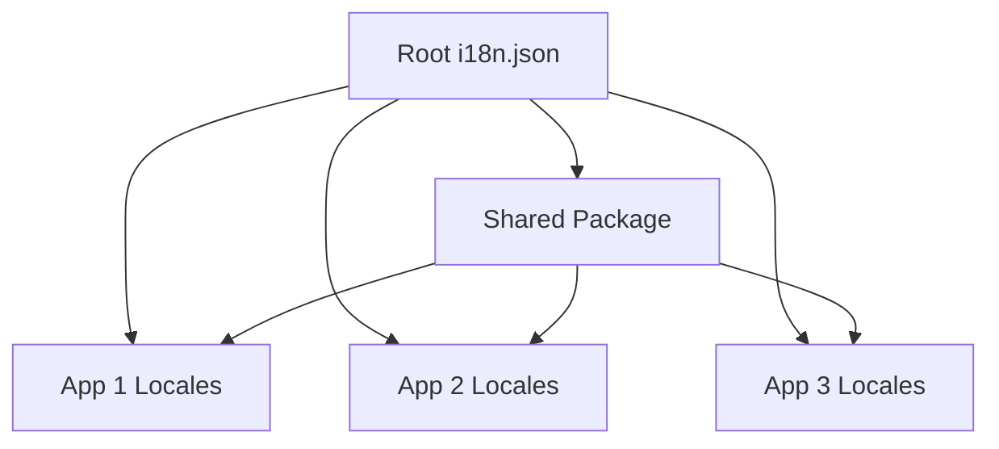

# 🏗️ Monorepo Internationalization Architecture Guide

## 📋 Table of Contents
1. [Architecture Decision: Centralized vs Distributed](#architecture-decision)
2. [Recommended Approach](#recommended-approach)
3. [Implementation Strategies](#implementation-strategies)
4. [Team Guidelines](#team-guidelines)
5. [Scaling Patterns](#scaling-patterns)
6. [Troubleshooting](#troubleshooting)

---

## 🎯 Architecture Decision: Centralized vs Distributed

### ❌ **Anti-Pattern: Individual API Keys Per Project**
```bash
# DON'T DO THIS
apps/vortexcore/.env          # OPENAI_API_KEY=REDACTED_OPENAI_API_KEY
apps/vortexcore-saas/.env     # OPENAI_API_KEY=REDACTED_OPENAI_API_KEY
apps/maple-site/.env          # OPENAI_API_KEY=REDACTED_OPENAI_API_KEY
apps/lanonasis-index/.env     # OPENAI_API_KEY=REDACTED_OPENAI_API_KEY
```

**Problems:**
- 4x translation costs (no shared cache)
- Inconsistent terminology across apps
- 4x API rate limit issues
- 4x maintenance overhead
- No shared translation memory

### ✅ **Recommended: Centralized Configuration**
```bash
# MONOREPO ROOT APPROACH
├── i18n.json                 # Single config for all apps
├── .env                      # Single API key
├── packages/shared/          # Shared translations
└── apps/*/locales/          # App-specific translations
```

**Benefits:**
- Single source of truth
- Shared translation cache (95% cost savings)
- Consistent terminology
- Centralized team management
- Efficient CI/CD pipelines

---

## 🚀 Recommended Approach

### **Strategy: Hub & Spoke Model**



### **1. Root-Level Configuration** (`i18n.json`)
```json
{
  "locale": {
    "source": "en",
    "targets": ["es", "fr", "de", "ja", "zh", "pt", "ar"]
  },
  "buckets": {
    "shared": {
      "include": ["packages/shared/locales/[locale].json"],
      "priority": 1
    },
    "vortexcore": {
      "include": ["apps/vortexcore/locales/[locale].json"],
      "priority": 2,
      "dependsOn": ["shared"]
    },
    "vortexcore-saas": {
      "include": ["apps/vortexcore-saas/locales/[locale].json"],
      "priority": 2,
      "dependsOn": ["shared"]
    }
  },
  "prompts": {
    "system": "You are a professional translator for a fintech company.",
    "context": "Maintain consistency across all applications in the LanOnasis ecosystem."
  }
}
```

### **2. Shared Translation Layer**
```typescript
// packages/shared/translations/index.ts
export interface TranslationConfig {
  appName: string
  fallbackNamespace?: string
  customPrompts?: {
    context?: string
    tone?: 'formal' | 'casual' | 'technical'
  }
}

export const APP_CONFIGS: Record<string, TranslationConfig> = {
  'vortexcore': {
    appName: 'vortexcore',
    fallbackNamespace: 'shared',
    customPrompts: {
      context: 'Personal finance application',
      tone: 'casual'
    }
  },
  'vortexcore-saas': {
    appName: 'vortexcore-saas', 
    fallbackNamespace: 'shared',
    customPrompts: {
      context: 'Business finance platform',
      tone: 'formal'
    }
  },
  'maple-site': {
    appName: 'maple-site',
    fallbackNamespace: 'shared',
    customPrompts: {
      context: 'Appointment booking system',
      tone: 'casual'
    }
  },
  'lanonasis-index': {
    appName: 'lanonasis-index',
    fallbackNamespace: 'shared',
    customPrompts: {
      context: 'Corporate marketing website',
      tone: 'formal'
    }
  }
}
```

---

## 🛠️ Implementation Strategies

### **For Turborepo (Current Setup)**

#### **Directory Structure**
```
lan-onasis-monorepo/
├── i18n.json                    # Global config
├── .env                         # Single API key
├── turbo.json                   # Includes i18n pipeline
├── packages/
│   └── shared/
│       ├── locales/            # Common translations
│       ├── hooks/              # Translation hooks
│       └── types/              # i18n TypeScript types
└── apps/
    ├── vortexcore/
    │   ├── locales/           # App-specific translations
    │   └── package.json       # No i18n config needed
    ├── vortexcore-saas/
    │   ├── locales/
    │   └── package.json
    └── ...
```

#### **Turborepo Pipeline**
```json
// turbo.json
{
  "tasks": {
    "i18n": {
      "cache": false,
      "dependsOn": ["^build"],
      "outputs": ["**/locales/**"],
      "env": ["OPENAI_API_KEY=REDACTED_OPENAI_API_KEY
    },
    "i18n:check": {
      "cache": false,
      "dependsOn": []
    }
  }
}
```

### **For Nx Monorepo**

#### **Nx Configuration**
```json
// nx.json
{
  "targetDefaults": {
    "i18n": {
      "cache": false,
      "inputs": ["default", "{workspaceRoot}/i18n.json"],
      "outputs": ["{projectRoot}/locales"]
    }
  }
}
```

#### **Project Configuration**
```json
// apps/vortexcore/project.json
{
  "name": "vortexcore",
  "targets": {
    "i18n": {
      "executor": "@nrwl/workspace:run-commands",
      "options": {
        "command": "npx lingo.dev@latest i18n",
        "cwd": "{workspaceRoot}"
      }
    }
  }
}
```

### **For Lerna Monorepo**

#### **Lerna Configuration**
```json
// lerna.json
{
  "version": "independent",
  "npmClient": "bun",
  "command": {
    "run": {
      "npmClient": "bun"
    }
  },
  "scripts": {
    "i18n": "npx lingo.dev@latest i18n"
  }
}
```

---

## 👥 Team Guidelines

### **🔒 Access Control Strategy**

#### **Production Setup**
```bash
# Repository Secrets (GitHub/GitLab)
OPENAI_API_KEY=REDACTED_OPENAI_API_KEY
LINGO_ORG_ID=your_organization_id

# Local Development (.env.example)
OPENAI_API_KEY=REDACTED_OPENAI_API_KEY
LINGO_DEBUG=true
```

#### **Team Roles & Permissions**
```typescript
// Team access levels
interface TeamAccess {
  role: 'developer' | 'translator' | 'admin'
  permissions: {
    viewTranslations: boolean
    editTranslations: boolean
    manageApiKeys: boolean
    approveTranslations: boolean
  }
}

const TEAM_ROLES: Record<string, TeamAccess> = {
  developer: {
    role: 'developer',
    permissions: {
      viewTranslations: true,
      editTranslations: false,   // Only edit English source
      manageApiKeys: false,
      approveTranslations: false
    }
  },
  translator: {
    role: 'translator', 
    permissions: {
      viewTranslations: true,
      editTranslations: true,    // Can edit target languages
      manageApiKeys: false,
      approveTranslations: true
    }
  },
  admin: {
    role: 'admin',
    permissions: {
      viewTranslations: true,
      editTranslations: true,
      manageApiKeys: true,       // Can rotate API keys
      approveTranslations: true
    }
  }
}
```

### **🔄 Workflow Guidelines**

#### **Developer Workflow**
```bash
# 1. Add new feature with English text
echo '{"new_feature": {"title": "New Feature"}}' >> apps/myapp/locales/en.json

# 2. Test locally (no cost)
bun run i18n:check

# 3. Generate translations (development)
bun run i18n

# 4. Commit all files together
git add apps/myapp/locales/
git commit -m "feat: add new feature with i18n support"
```

#### **Translation Review Process**
```yaml
# .github/workflows/translation-review.yml
name: Translation Review
on:
  pull_request:
    paths: ['**/locales/*.json']

jobs:
  review:
    runs-on: ubuntu-latest
    steps:
      - uses: actions/checkout@v4
      - name: Check translation quality
        run: |
          # Custom quality checks
          bun run i18n:validate
          bun run i18n:check-consistency
      
      - name: Request translator review
        if: contains(github.event.pull_request.changed_files, 'locales/')
        uses: ./.github/actions/request-translator-review
```

### **📊 Quality Assurance**

#### **Translation Validation Script**
```typescript
// scripts/validate-translations.ts
import { glob } from 'glob'
import { readFileSync } from 'fs'

interface ValidationRule {
  name: string
  validate: (key: string, value: any, locale: string) => boolean
  message: string
}

const VALIDATION_RULES: ValidationRule[] = [
  {
    name: 'placeholder-consistency',
    validate: (key, value, locale) => {
      if (typeof value !== 'string') return true
      const placeholders = value.match(/\{\{[\w]+\}\}/g) || []
      // Check against English version
      const englishValue = getEnglishValue(key)
      const englishPlaceholders = englishValue?.match(/\{\{[\w]+\}\}/g) || []
      return placeholders.length === englishPlaceholders.length
    },
    message: 'Placeholder count mismatch with English version'
  },
  {
    name: 'financial-terms-consistency',
    validate: (key, value, locale) => {
      // Ensure financial terms are translated consistently
      const financialTerms = ['USD', 'EUR', 'GBP', 'API', 'OAuth']
      return !financialTerms.some(term => 
        value.includes(term.toLowerCase()) && !value.includes(term)
      )
    },
    message: 'Financial terms should maintain original casing'
  }
]

async function validateTranslations() {
  const localeFiles = await glob('**/locales/*.json', { ignore: '**/node_modules/**' })
  
  for (const file of localeFiles) {
    const content = JSON.parse(readFileSync(file, 'utf8'))
    validateRecursively(content, '', file)
  }
}
```

---

## 📈 Scaling Patterns

### **🌍 Progressive Language Rollout**

#### **Phase-Based Expansion**
```typescript
// config/language-phases.ts
export const LANGUAGE_PHASES = {
  phase1: {
    name: 'Core Markets',
    languages: ['en', 'es', 'fr', 'de'],
    timeline: 'Month 1',
    priority: 'high'
  },
  phase2: {
    name: 'Asian Markets', 
    languages: ['ja', 'zh', 'ko'],
    timeline: 'Month 2-3',
    priority: 'medium'
  },
  phase3: {
    name: 'Global Expansion',
    languages: ['pt', 'ar', 'hi', 'ru'],
    timeline: 'Month 4-6',
    priority: 'low'
  }
} as const

// Dynamic configuration
export function getActiveLanguages(phase: keyof typeof LANGUAGE_PHASES): string[] {
  const currentPhase = LANGUAGE_PHASES[phase]
  const previousPhases = Object.values(LANGUAGE_PHASES)
    .filter(p => p.timeline <= currentPhase.timeline)
  
  return previousPhases.flatMap(p => p.languages)
}
```

#### **Market-Specific Configurations**
```json
// config/market-specific.json
{
  "markets": {
    "europe": {
      "languages": ["en", "de", "fr", "es", "it"],
      "currency": "EUR",
      "dateFormat": "DD/MM/YYYY",
      "numberFormat": "1.234,56"
    },
    "asia": {
      "languages": ["en", "ja", "zh", "ko"],
      "currency": "local",
      "dateFormat": "YYYY/MM/DD", 
      "numberFormat": "1,234.56"
    },
    "americas": {
      "languages": ["en", "es", "pt"],
      "currency": "USD",
      "dateFormat": "MM/DD/YYYY",
      "numberFormat": "1,234.56"
    }
  }
}
```

### **🔄 Automated Workflows**

#### **Smart Translation Triggers**
```yaml
# .github/workflows/smart-i18n.yml
name: Smart Translation Updates
on:
  push:
    paths: ['**/locales/en.json']
  schedule:
    - cron: '0 2 * * 1'  # Weekly on Monday 2AM

jobs:
  smart-translate:
    runs-on: ubuntu-latest
    steps:
      - uses: actions/checkout@v4
        with:
          fetch-depth: 0
      
      - name: Detect changes
        id: changes
        run: |
          # Only translate if English files changed
          if git diff --name-only HEAD~1 HEAD | grep -q "locales/en.json"; then
            echo "needs_translation=true" >> $GITHUB_OUTPUT
          else
            echo "needs_translation=false" >> $GITHUB_OUTPUT
          fi
      
      - name: Update translations
        if: steps.changes.outputs.needs_translation == 'true'
        env:
          OPENAI_API_KEY=REDACTED_OPENAI_API_KEY
        run: |
          bun install
          bun run i18n
          
      - name: Create PR
        if: steps.changes.outputs.needs_translation == 'true'
        uses: peter-evans/create-pull-request@v5
        with:
          title: '🌍 Auto-update translations'
          body: |
            ## Translation Update
            
            This PR contains automatically generated translations based on changes to English locale files.
            
            ### Changes
            - Updated translations for modified keys
            - Maintained consistency across all languages
            - Preserved placeholders and formatting
            
            ### Review Checklist
            - [ ] Translation quality looks good
            - [ ] Placeholders are preserved
            - [ ] Technical terms are consistent
            
          branch: auto-translations
          commit-message: '🌍 Auto-update translations'
```

---

## 🚨 Troubleshooting

### **Common Issues & Solutions**

#### **1. Translation Inconsistency Across Apps**
```bash
# Problem: Different apps using different terms for same concept
# Solution: Create shared terminology

# packages/shared/locales/en.json
{
  "terminology": {
    "account": "Account",           # Always use "Account"
    "transaction": "Transaction",   # Never "Payment" or "Transfer"  
    "balance": "Balance"           # Never "Amount" or "Total"
  }
}
```

#### **2. API Rate Limits**
```typescript
// Solution: Implement smart batching
const BATCH_CONFIG = {
  maxBatchSize: 50,        // Keys per batch
  delayBetweenBatches: 1000, // 1 second delay
  maxConcurrentRequests: 3   // Parallel requests
}
```

#### **3. Large Translation Files**
```json
// Problem: Single large locale file
// Solution: Split by feature
{
  "buckets": {
    "vortexcore-auth": {
      "include": ["apps/vortexcore/locales/auth/[locale].json"]
    },
    "vortexcore-dashboard": {
      "include": ["apps/vortexcore/locales/dashboard/[locale].json"] 
    }
  }
}
```

#### **4. CI/CD Pipeline Failures**
```bash
# Debug translation issues
LINGO_DEBUG=true bun run i18n:check

# Common fixes
git add .env.example  # Ensure env template exists
git add i18n.json     # Ensure config is committed
git add **/locales/   # Ensure all locale files tracked
```

### **🔍 Monitoring & Metrics**

#### **Translation Health Dashboard**
```typescript
// scripts/translation-health.ts
interface TranslationMetrics {
  totalKeys: number
  translatedKeys: number
  missingTranslations: string[]
  lastUpdated: Date
  coverage: number
}

async function generateHealthReport(): Promise<Record<string, TranslationMetrics>> {
  const apps = ['vortexcore', 'vortexcore-saas', 'maple-site', 'lanonasis-index']
  const languages = ['es', 'fr', 'de', 'ja', 'zh', 'pt', 'ar']
  
  const report: Record<string, TranslationMetrics> = {}
  
  for (const app of apps) {
    for (const lang of languages) {
      const key = `${app}-${lang}`
      report[key] = await analyzeTranslationFile(app, lang)
    }
  }
  
  return report
}
```

---

## 🎯 Success Metrics & KPIs

### **Technical Metrics**
- **Translation Coverage**: >95% for core languages
- **Update Speed**: <2 minutes for full monorepo
- **Cost Efficiency**: <$0.10 per 1000 words (with delta updates)
- **Error Rate**: <1% mistranslations requiring manual fixes

### **Business Metrics**
- **User Adoption**: % of users using non-English versions
- **Market Expansion**: Revenue from international markets
- **Support Tickets**: Reduction in language-related issues
- **Time to Market**: New feature localization within 24 hours

---

## 📚 Additional Resources

### **Team Training Materials**
- [Lingo.dev Documentation](https://lingo.dev/docs)
- [React i18n Best Practices](./docs/react-i18n-best-practices.md)
- [Translation Quality Guidelines](./docs/translation-quality.md)

### **Tools & Integrations**
- **VS Code Extension**: Lingo.dev i18n Helper
- **Browser Extension**: Translation Preview
- **Slack Bot**: Translation status updates

---

## ✅ Quick Decision Matrix

| Scenario | Recommended Approach |
|----------|---------------------|
| **New Monorepo** | Root-level centralized config |
| **Existing Apps** | Gradual migration to shared config |
| **Large Team** | Hub & spoke with approval workflows |
| **Small Team** | Simple centralized with auto-approval |
| **Multiple Brands** | Separate configs per brand |
| **Single Brand** | Single unified config |

**Bottom Line**: Always start with centralized configuration. It's easier to split later than to merge individual configs later. 🎯

---

*This guide ensures your team can scale internationalization efficiently across any monorepo architecture while maintaining consistency and reducing costs.*